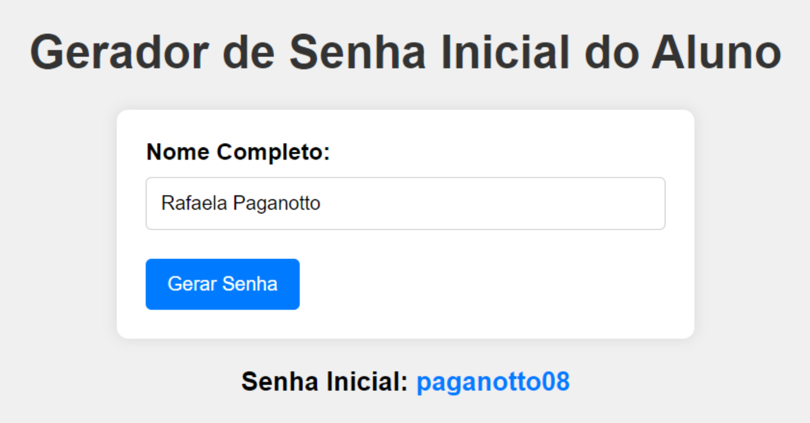

# Descodficadas: Tarefa 3 - senha inicial

Elaborar um programa que leia o nome completo de um aluno.

1. **Validação e Geração de Senha**  
   O programa deve validar o preenchimento de um nome completo e exibir a senha inicial do aluno, a qual será o sobrenome seguido pelo número de vogais do nome completo dele.

2. **Funções Principais**  
   O programa deve conter as seguintes funções (e dependendo da lógica, poderá ter outras):

   - **`validarNome()`**  
     Recebe um nome como parâmetro e retorna:
     - `true` (se for um nome completo)
     - `false` (se for um nome incompleto).
     
   - **`obterSobrenome()`**  
     Recebe um nome como parâmetro e retorna o último nome do aluno **em letras minúsculas**.

   - **`contarVogais()`**  
     Recebe um nome e retorna o **número de vogais** deste nome, com **dois dígitos**. Exemplo: uma vogal é retornada como `01`, duas como `02`, etc.

   
